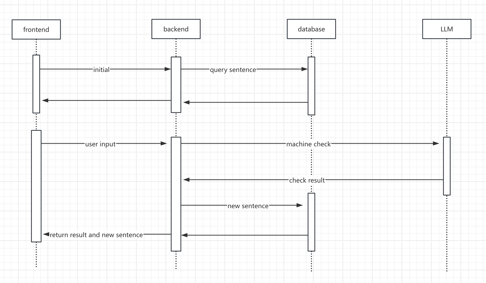

# Japanese Translation Practice & Evaluation System

[日本語版 → README.ja.md](./README.ja.md)

---

## Overview

This project is a **Japanese translation practice and evaluation system**  
designed for Japanese language learners.

Learners submit their Japanese translations, and the system automatically evaluates them using an LLM (Ollama), focusing
on:

- Grammar correctness
- Particle usage
- Naturalness of expression
- Overall score

The system records learning progress and provides the next practice sentence, enabling **continuous and structured
learning**.

---

## Features

- Automatic evaluation of Japanese translations (LLM-based)
- Correct / Incorrect judgment
- Learning history persistence
- User progress tracking (current sentence)
- Automatic next-sentence recommendation
- Ollama API–compatible responses (supports ollama-webui-lite)

---

## System Architecture

```mermaid
flowchart TD
    Client["Client<br/><a href='https://github.com/joshaken/ollama-webui-lite'>ollama-webui-lite</a>"] --> Gateway["Spring Cloud Gateway"]
    Gateway --> API["Spring WebFlux API"]
    API --> Ollama["LLM<br/><a href='https://github.com/ollama/ollama'>Ollama</a>"]
    Ollama --> DB["H2 Database"]
 ```

---

## Tech Stack

### Backend

- Java 21
- Spring Boot
- Spring WebFlux
- Spring Gateway
- R2DBC
- Project Reactor

### LLM

- Ollama
- Supports both streaming and non-streaming responses

### Database

- H2 Database / postgres

---

## Processing Flow

1. User submits a translated sentence
2. System retrieves the current practice sentence
3. Translation is sent to the LLM
4. Evaluation result is parsed
5. Learning record is saved
6. The next practice sentence is returned


---

## Database Design (Summary)

- users
- sentences
- user_answer_record

These tables manage user progress and answer history.

---

## Key Design Points

- **Reactive Programming**
    - Built with Spring WebFlux and Reactor
    - Safe handling of LLM streaming responses

- **LLM Response Control**
    - Evaluation data is used internally
    - Frontend receives Ollama-compatible responses only

- **Learning-Oriented Design**
    - Stores minimal evaluation results (correct / incorrect)
    - Evaluation logic can be extended easily

---

## Purpose of This Project

- Practical experience with the reactive stack
- Backend design with LLM integration
- Building a real-world language learning support system

---

## Future Improvements

- Enhanced user management
- Difficulty-based sentence categorization
- Customizable evaluation rules

---

## License

This project is licensed under the GNU General Public License v3.0 - see the [LICENSE](LICENSE) file for details.
